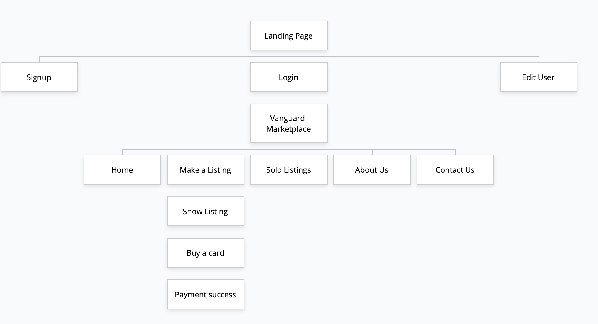
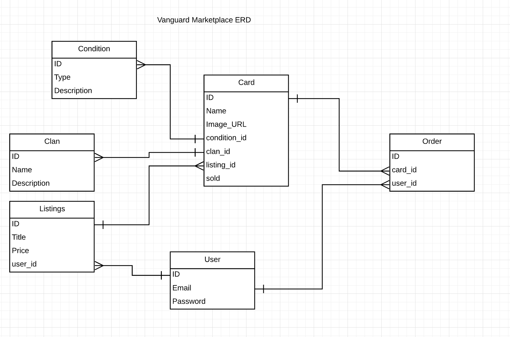

# README

This README would normally document whatever steps are necessary to get the
application up and running.

# Marketplace

# R7 Identification of the problem you are trying to solve by building this particular marketplace app.

The aim of the project is to create a marketplace app of our choice using Ruby on Rails as part of the web development framework. The main features that needed to be implemented was CRUD in our marketplace apps. The marketplace I chose for this project was a trading card game named Vanguard Marketplace. Vanguard is a trading card game that is quite popular in Japan, Australia and all over the world. Often due to the community many players, there comes a supply and demand issue in Vanguard. The aim of this marketplace is to be able to help out buyers who are looking for cards that they need and looking to sell what they dont need.

# R8 Why is it a problem that needs solving?

In terms of real world issues, this app does not solve anything related to that. However, in the Vanguard community, this is an issue that needs solving because players are unable to enjoy the card game if they cannot find what they are looking for. This will also give new players the problem of not being able to find cards to make their gameplay overall stronger. That way players will all be able to enjoy the game without the others having a severe disadvantage.

# R9 A link (URL) to your deployed app (i.e. website)

Link to live site: https://cryptic-oasis-30547.herokuapp.com/

# R10 A link to your GitHub repository (repo)

Link to my Github repository: https://github.com/jason20194/marketplace

# R11 Description of your marketplace app (website)

## Purpose

The purpose of this Marketplace application is to create a two sided marketplace for both buying and selling to users. This application allows a user to list a card for sale and to buy another user's card listed for sale.

## Functionality

-Login/Signup for user authentication using Devise

-Stripe API enabled to process payments when buying a card

-Amazon Web Services S3 image bucket for displaying pictures of the card listed.

-Storing database tables using Postgresql

-Storing data inside Rails Console

-User access rights (stopping other users from editing their listing)

-Sold listings table (displays the listing everytime a card is bought or sold)

-CRUD method (allows user to create, read, update and destroy data)

## Sitemap



## Screenshots

- Signup page

- Login page

- Edit User page

- Homepage

- Listing page

- Show page

- Buy page

- Sold page

- About Us page

- Contact Us page


## Target Audience
The main audience of this web application are mostly Vanguard players, or card sellers who are using Vanguard as a way of doing their business. It also targets new players who are just getting into the game and are looking for some cards that they need.

## Tech Stack

- Ruby

- Ruby on Rails

- Bootstrap

- Heroku

- Stripe API

- Postgres

- Rails Console

- AWS S3

# R12 User stories

<table style="width:100%">
    <tr>
      <th>User Stories</th>
      <th>Acceptance Criteria</th>
    </tr>
    <tr>
      <td>As a user I want to only be able to access the marketplace once Ive signed up or signed in</td>
      <td>
        <ul>
           <li>
            go to the applications homepage
           </li>
           <li>
            I should be redirected to a signups page stating that I must sign in to continue
           </li>
        </ul>
      </td>
    </tr>
    <tr>
      <td>As a user I want to register to signup as a user and log into the website</td>
      <td>
        <ul>
           <li>
            See a signups page
           </li>
           <li>
            Able to go to signups page and go into a signup page with details to register as a user.
           </li>
           <li>
            Able to correct errors, incase new user adds wrong signup details
           </li>
           <li>
            Login to the app after signing up
           </li>
        </ul>
      </td>
    </tr>
    <tr>
      <td>As a user I want the user to be able to edit their details or cancel their account if they want.</td>
      <td>
        <ul>
          <li>
            have a edit user page where details can be changed or account can be cancelled
          </li>
        </ul>
      </td>
    </tr>
    <tr>
      <td>As a user I want to be able to list a card for sale</td>
      <td>
        <ul>
          <li>
            See a make a listing button
          </li>
          <li>
            Add in details and click create listing
          </li>
          <li>
            Users listing should be displayed in the listings index
          </li>
        </ul>
      </td>
    </tr>
    <tr>
      <td>As a user I want to be able to buy a card from another persons listing</td>
      <td>
        <ul>
          <li>
            Go to the listings index
          </li>
          <li>
            click show in another users listing
          </li>
          <li>
            have a buy button that can be clicked to purchase the card
          </li>
        </ul>
      </td>
    </tr>
    <tr>
      <td>As a user I want to see a payment confirmation page once Ive entered in my card details</td>
      <td>
        <ul>
          <li>
            Once credit card details have been inserted, be directed into the success page for payments with a message of payment being successful
          </li>
        </ul>
      </td>
    </tr>
    <tr>
      <td>As a user I want to see past sales that may have been made by me</td>
      <td>
        <ul>
          <li>
            See a link on the navbar to go to the sold listings page
          </li>
          <li>
            on the sold listings, there will be the name of the card, condition and which user sold the card
          </li>
        </ul>
      </td>
    </tr>
    <tr>
      <td>As a user I want to make sure no one else can edit my listing</td>
      <td>
        <ul>
          <li>
            Go to listings index as another user after listing a card in my account
          </li>
          <li>
            See the listings index
          </li>
          <li>
            User can only see a show button but no edit on my listing
          </li>
        </ul>
      </td>
    </tr>
    <tr>
      <td>As a user I want to be able to contact the admin</td>
      <td>
        <ul>
          <li>
            See a link on the navbar to contact the admins
          </li>
          <li>
            See the contact us page with forms for inputting user details and the message
          </li>
        </ul>
      </td>
    </tr>
    <tr>
      <td>As a user I want to be able to edit my listings incase I make a mistake</td>
      <td>
        <ul>
          <li>
            See a edit button on the listing index page for my own card listing
          </li>
          <li>
            click on edit button to an edit form to edit the card
          </li>
          <li>
            save and the card in the index page should be changed
          </li>
        </ul>
      </td>
    </tr>
  </table>

# R13 Wireframes for the application

# R14 Entity Relationship Diagram for the application



# R15 Explain the different high-level components (abstractions) in your application

The main method that I used in my rails Marketplace application is the Model Views and Controller architecture (MVC). First I planned out my ERD, and after I generated my models using the ruby on rails generate command, then after created my controllers and then at last once ive routed my controllers into my views I made view pages where the controllers methods will route into.

## Model

Active Record is the Model (M) in the MVC architecture - which is the layer that is responsible for the databases. Active Record allows the creation of Models which gives the Rails application the data logic that it uses in its database storage system.

What does Active Record Do?

Active record allows the use of embedded ruby instead of using MYSQL to display databases in the application. They also allow data to be validated before they are stored into their respective database tables.

## Rails Web Server

Rails Web Server is the web server that is responsible for getting the http request of the web application. At the same time it is what routes everything in the rails application using the routes.rb file inside the config folder in the application.

## Views

Views are essentially the front end of the rails application. It is what humans are able to see displayed onto the screen when they access a webpage. Views rely on data passed into the models that are routed by the controllers to display their information.

## Controller

The Controller is the most important part of the MVC architecture. It is what controls how the data from the models is going to be displayed in the views. The controller has two parts, which is the controller and the routes file. The controller holds the methods used to call data and routes is used to route the method that calls data into the view. It also allows the implementation of CRUD into the application. CRUD is create read update destroy. Controllers allow data to be generated (created), read, updated, edited and destroyed.

# R16 Detail any third party services that the application will use

## Amazon Web Services S3 Image Bucket

Amazon Web Services S3 storage service is for being able to store blob files and scale web applications. Storing blob files can be very costly to maintain such a database. This is why Amazon built S3, which is not too expensive to run but also allows users to store their images into a image bucket and have access to it and display it in their web applications at the same time whilst keeping their data safe with their user credentials being protected. That way, no one else is able to hack into their storage and edit or delete images.

## Stripe Payment API

Stripe Payment API allows web developers to implement a payment gateway into their web applications that act and function like a real life payment gateway. Stripe Payment API allows users to implement into their applications a way for buyers to input their credentials using test or dummy credentials and go through the payment process similar to a real payment process. Stripe is easy to use, as tutorials on how to implement Stripe API is clear and concise even for beginner deverlopers.

## Heroku

Heroku allows a user to host their web applications for free. Because a lot of times, many users will have trouble accessing another users web application through localhost. Heroku fixes this by allowing everyone to have access to the users web application with no issues as long as they have the link to the web application. It is also very easy to use as Heroku allows an app to be deployed when changes are made using a Github repository. It also contains free dynos so that users dont have to pay for using Heroku. It also keeps users web applications safe through a users own Master Key, which stops hackers from tampering with their applications.

# R17 Describe your projects models in terms of the relationships (active record associations) they have with each other

## Models

-User
-Listing
-Card
-Clan
-Condition
-Order

The User model has a one to many relationship with the Listings table. Users can have many listings and this is also shown in the ERD. User also has a one to many relationship with Orders as a user can have many orders.

Listing has a many to one relationship with the User table and a one to many relationship with Cards.

Card has a one to many relationship with clan and conditions. Card also has a many to one relationship with Listing because a listing can have many cards (can use the same listing title and price).

The Clan model has a many to one relationship with the Cards table. This is because a clan is what will categorise the card. A card can belong to any clan but a clan can only belong to a card.

Condition has a many to one relationship with the Cards table. Similar to clan, a card can have many conditions (wear and tear) but one condition can only belong to one card.

Order has a many to one relationship with both user and card.

# R18 Discuss the database relations to be implemented in your application

User model will relate to listings which listings will relate to cards. This is done because that way users exclusive rights can be implemented into the application. The user model uses devise to login to the marketplace, however user id will also be inside listings. That way a user will only be able to edit his or her own listings and no one elses. User at the same time will not allow a user to buy his or her own listing.

User model

```
class User < ApplicationRecord
# Include default devise modules. Others available are:
# :confirmable, :lockable, :timeoutable, :trackable and :omniauthable
devise :database_authenticatable, :registerable,
:recoverable, :rememberable, :validatable
 has_many :listings
 has_many :orders
end
```


User is able to check what is associated with his listings

```
@user = User.find(1)
listing = @user.listings.all
orders = @user.orders.all 
```
User can authorize their own data but no one else can

```
<% if card.listing.user_id == current_user.id  %>
```

Listing relates to cards because when a user lists a card for sale, he and she will only be able to access their own listing titles and prices and no one elses.

```
class Listing < ApplicationRecord
    belongs_to :user, required: false
    has_many :cards, dependent: :destroy
    accepts_nested_attributes_for :cards
end
```

Finding the user that created the listing

```
Listing.find(1).user 
```

Finding the card associated with the listing

```
Listing.find(1).cards
```

Card relates to listing because a listing can have many cards. Card also relates to clan and condition since a clan belongs to a card and a condition also belongs to a card.

```
class Card < ApplicationRecord
    belongs_to :listing, required: false
    has_many :clans
    has_many :conditions
    has_many :orders
    has_one_attached :picture
end
```

Finding a listing associated with a card

```
Card.find(1).listing
```

Finding a order associated with a card

```
Card.find(1).order
```

Clan relates to card because a card can have many clans.

```
class Clan < ApplicationRecord
    belongs_to :card, required: false
end
```

Finding a clan associated with a card

```
Card.find(1).clan_id 
```
Condition relates to a card because a card can have many conditions

```
class Condition < ApplicationRecord
    belongs_to :card, required: false
end

```

Finding a condition associated with a card

```
Card.find(1).condition_id
```

Order relates to a user because a user can have many orders

```
class Order < ApplicationRecord
    belongs_to :user, required: false
    belongs_to :card, required: false
end
```
# R19 Provide your database schema design

## User Schema
```
create_table "users", force: :cascade do |t|
    t.string "email", default: "", null: false
    t.string "encrypted_password", default: "", null: false
    t.string "reset_password_token"
    t.datetime "reset_password_sent_at"
    t.datetime "remember_created_at"
    t.datetime "created_at", null: false
    t.datetime "updated_at", null: false
    t.index ["email"], name: "index_users_on_email", unique: true
    t.index ["reset_password_token"], name: "index_users_on_reset_password_token", unique: true
  end
```
## Listing Schema
```
create_table "listings", force: :cascade do |t|
    t.string "title", null: false
    t.float "price", null: false
    t.datetime "created_at", null: false
    t.datetime "updated_at", null: false
    t.bigint "user_id"
    t.index ["user_id"], name: "index_listings_on_user_id"
  end
```
## Card Schema
```
create_table "cards", force: :cascade do |t|
    t.string "name", null: false
    t.text "image_url"
    t.datetime "created_at", null: false
    t.datetime "updated_at", null: false
    t.bigint "condition_id"
    t.bigint "clan_id"
    t.bigint "listing_id"
    t.boolean "sold", default: false
    t.index ["clan_id"], name: "index_cards_on_clan_id"
    t.index ["condition_id"], name: "index_cards_on_condition_id"
    t.index ["listing_id"], name: "index_cards_on_listing_id"
  end

```
## Clan Schema
```
create_table "clans", force: :cascade do |t|
    t.string "name", null: false
    t.text "description"
    t.datetime "created_at", null: false
    t.datetime "updated_at", null: false
  end

```
## Condition Schema
```
create_table "conditions", force: :cascade do |t|
    t.datetime "created_at", null: false
    t.datetime "updated_at", null: false
    t.text "description"
    t.string "card_type"
  end
```

## Order Schema
```
 create_table "orders", force: :cascade do |t|
    t.datetime "created_at", null: false
    t.datetime "updated_at", null: false
    t.bigint "card_id"
    t.index ["card_id"], name: "index_orders_on_card_id"
  end
```
# R20 Describe the way tasks are allocated and tracked in your project

I used Trelloboard as a way to plan out and allocate tasks and track tasks in my project. Every two days, I would update Trello and check off tasks that are complete, pile up new tasks that need to be done, keep track of what tasks are in progress and also what still hasnt been done. Here is a screenshot of my TrelloBoard:


